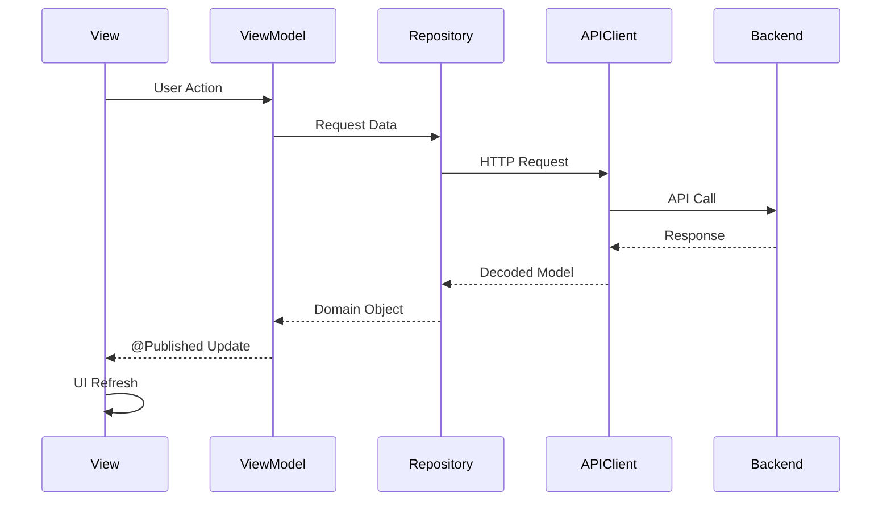
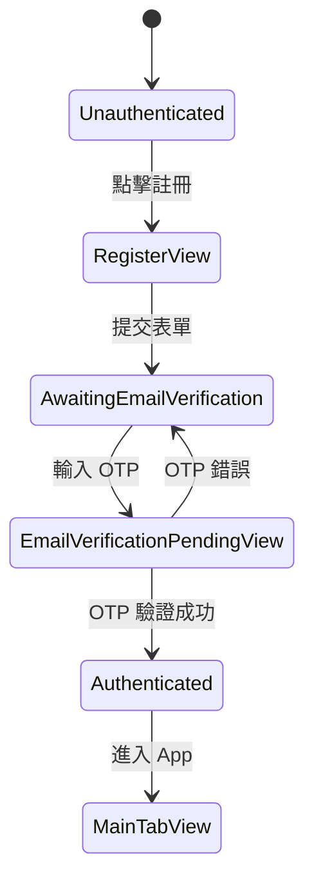
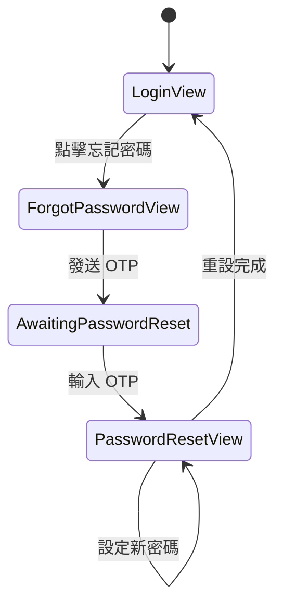

# 🏗️ Raibu iOS 前端架構文件

**版本**: 1.0  
**更新日期**: 2026/01/09

---

## I. 架構總覽

Raibu iOS App 採用 **MVVM + Repository** 架構模式，結合 **依賴注入 (DI)** 管理服務生命週期。

```mermaid
graph TB
    subgraph App Layer
        RaibuApp[RaibuApp.swift]
        DIContainer[DIContainer]
        NavCoord[NavigationCoordinator]
    end

    subgraph Views
        ContentView --> AuthViews[Auth Views]
        ContentView --> MainTabView
        MainTabView --> MapViews[Map Views]
        MainTabView --> ProfileViews[Profile Views]
    end

    subgraph Core Services
        AuthService
        APIClient
        LocationManager
        UploadService
    end

    subgraph Repositories
        RecordRepo[RecordRepository]
        AskRepo[AskRepository]
        ReplyRepo[ReplyRepository]
        UserRepo[UserRepository]
    end

    RaibuApp --> DIContainer
    DIContainer --> Core Services
    DIContainer --> Repositories
    Views --> Core Services
    Views --> Repositories
```

---

## II. 目錄結構

```
frontend/Raibu/Raibu/
├── 📁 App/                          # 應用程式入口與配置
│   ├── RaibuApp.swift               # @main App 入口點
│   ├── DIContainer.swift            # 依賴注入容器
│   ├── NavigationCoordinator.swift  # 導航狀態管理
│   ├── ContentView.swift            # 根導航視圖
│   └── MainTabView.swift            # 主 Tab 導航
│
├── 📁 Core/                         # 核心服務層
│   ├── 📁 Auth/
│   │   ├── AuthService.swift        # 認證服務 (Supabase)
│   │   └── KeychainManager.swift    # Token 安全儲存
│   ├── 📁 Network/
│   │   ├── APIClient.swift          # HTTP 請求封裝
│   │   ├── APIEndpoint.swift        # API 端點定義
│   │   └── APIError.swift           # 錯誤類型
│   ├── 📁 Location/
│   │   └── LocationManager.swift    # 位置服務
│   ├── 📁 Upload/
│   │   └── UploadService.swift      # 圖片上傳服務
│   ├── 📁 Photo/
│   │   └── PhotoPickerService.swift # 相簿存取
│   └── 📁 Components/
│       └── PasswordValidationView.swift
│
├── 📁 Features/                     # 功能模組
│   ├── 📁 Auth/                     # 認證功能
│   │   ├── 📁 Views/
│   │   │   ├── LoginView.swift
│   │   │   ├── RegisterView.swift
│   │   │   ├── EmailVerificationPendingView.swift
│   │   │   ├── PasswordResetView.swift
│   │   │   ├── ForgotPasswordView.swift
│   │   │   └── AuthContainerView.swift
│   │   └── 📁 Components/
│   │       └── OTPDigitBox.swift
│   ├── 📁 Map/                      # 地圖功能
│   │   ├── Views/
│   │   └── ViewModels/
│   ├── 📁 Record/                   # 紀錄標點
│   │   ├── Views/
│   │   ├── ViewModels/
│   │   └── Repositories/
│   ├── 📁 Ask/                      # 詢問標點
│   ├── 📁 Reply/                    # 回覆功能
│   └── 📁 Profile/                  # 個人頁面
│
└── 📁 Shared/                       # 共用資源
    ├── 📁 Models/                   # 資料模型
    │   ├── User.swift
    │   ├── Record.swift
    │   ├── Ask.swift
    │   ├── Reply.swift
    │   ├── ImageMedia.swift
    │   └── Like.swift
    └── 📁 Components/               # 共用 UI 元件
        ├── BottomSheetView.swift
        ├── ImageCarouselView.swift
        ├── LikeButton.swift
        └── ToastView.swift
```

---

## III. 核心元件說明

### 1. DIContainer (依賴注入容器)

管理所有服務的單一實例，確保依賴關係正確初始化。

```swift
class DIContainer: ObservableObject {
    // Core Services
    let authService: AuthService
    let apiClient: APIClient
    let locationManager: LocationManager
    let uploadService: UploadService

    // Repositories (lazy 延遲初始化)
    lazy var recordRepository: RecordRepository
    lazy var askRepository: AskRepository
    // ...
}
```

**使用方式**：透過 `@EnvironmentObject` 注入到 Views。

---

### 2. AuthService (認證服務)

管理與 Supabase Auth 的所有互動。

| 功能     | 方法                                  |
| -------- | ------------------------------------- |
| 登入     | `signIn(email:password:)`             |
| 註冊     | `signUp(email:password:displayName:)` |
| OTP 驗證 | `verifyOTP(email:token:)`             |
| 密碼重設 | `sendPasswordResetOTP(email:)`        |
| 登出     | `signOut()`                           |

**狀態管理**：

```swift
enum AuthState {
    case unauthenticated
    case awaitingEmailVerification(email: String)
    case awaitingPasswordReset(email: String)
    case authenticated
}
```

---

### 3. APIClient (網路請求)

統一的 HTTP 請求封裝，自動注入 Auth Token。

```swift
class APIClient {
    func get<T: Decodable>(_ endpoint: APIEndpoint) async throws -> T
    func post<T: Decodable, B: Encodable>(_ endpoint: APIEndpoint, body: B) async throws -> T
    func patch<T: Decodable, B: Encodable>(_ endpoint: APIEndpoint, body: B) async throws -> T
    func delete(_ endpoint: APIEndpoint) async throws
    func uploadToPresignedURL(data: Data, url: URL, contentType: String) async throws
}
```

---

### 4. Repository Pattern

資料存取抽象層，隔離 API 呼叫細節。

```swift
class RecordRepository {
    private let apiClient: APIClient

    func getMapRecords(bounds: MapBounds) async throws -> [ImageMedia]
    func getRecordDetail(id: String) async throws -> Record
    func createRecord(request: CreateRecordRequest) async throws -> Record
}
```

---

## IV. 資料流



---

## V. 認證流程

### 註冊流程



### 密碼重設流程



---

## VI. 設計決策

### 為什麼使用 MVVM + Repository？

| 優點           | 說明                                    |
| -------------- | --------------------------------------- |
| **可測試性**   | Repository 可用 Mock 取代，方便單元測試 |
| **關注點分離** | View 只負責 UI，ViewModel 負責業務邏輯  |
| **可重用性**   | Repository 可被多個 ViewModel 共用      |

### 為什麼使用 DIContainer？

| 優點         | 說明                   |
| ------------ | ---------------------- |
| **單一實例** | 確保服務不會重複建立   |
| **依賴順序** | 明確管理初始化順序     |
| **可替換性** | 測試時可注入 Mock 服務 |

### 為什麼拆分 RaibuApp.swift？

| 之前            | 之後               |
| --------------- | ------------------ |
| 1310 行單一檔案 | 11 個模組化檔案    |
| 難以維護        | 每個檔案職責單一   |
| 編譯慢          | 增量編譯更快       |
| 難以測試        | 每個元件可獨立測試 |

---

## VII. 重構改善項目

### 已修復問題

1. **Timer 記憶體洩漏**

   - `EmailVerificationPendingView` 和 `PasswordResetView` 的 OTP 倒計時 Timer
   - 改用 `onDisappear` 清理 Timer

2. **程式碼重複**
   - 抽取 `OTPDigitBox` 共用元件
   - 複用 `PasswordValidationView`

### 新增檔案清單

| 檔案                                                     | 說明               |
| -------------------------------------------------------- | ------------------ |
| `Features/Auth/Components/OTPDigitBox.swift`             | OTP 單一數字輸入框 |
| `Features/Auth/Views/LoginView.swift`                    | 登入頁面           |
| `Features/Auth/Views/RegisterView.swift`                 | 註冊頁面           |
| `Features/Auth/Views/EmailVerificationPendingView.swift` | Email OTP 驗證     |
| `Features/Auth/Views/PasswordResetView.swift`            | 密碼重設           |
| `Features/Auth/Views/ForgotPasswordView.swift`           | 忘記密碼           |
| `Features/Auth/Views/AuthContainerView.swift`            | 認證容器           |
| `App/ContentView.swift`                                  | 根導航視圖         |
| `App/MainTabView.swift`                                  | 主 Tab 導航        |

---

## VIII. 圖片快取機制

Raibu 使用 **[Kingfisher](https://github.com/onevcat/Kingfisher)** 作為圖片下載與快取解決方案。

### 為什麼使用 Kingfisher？

| 優點           | 說明                                      |
| -------------- | ----------------------------------------- |
| **雙層快取**   | 記憶體 + 磁碟快取，App 重啟後不需重新下載 |
| **自動重試**   | 網路錯誤時自動重試（最多 2 次）           |
| **下載取消**   | View 消失時自動取消進行中的下載           |
| **記憶體管理** | 低記憶體時自動清理                        |
| **漸進式顯示** | 支援 fade 動畫，提升 UX                   |

### 目錄結構更新

```
Core/
├── 📁 Image/
│   └── CachedImage.swift        # Kingfisher 封裝元件
```

### 使用方式

#### 基本用法 (KFImage)

```swift
import Kingfisher

KFImage(URL(string: imageUrl))
    .placeholder {
        Rectangle()
            .fill(Color(.systemGray5))
            .shimmer()
    }
    .retry(maxCount: 2, interval: .seconds(1))
    .cacheOriginalImage()
    .fade(duration: 0.2)
    .resizable()
    .scaledToFill()
```

#### 頭像專用 (圓形)

```swift
KFImage(URL(string: avatarUrl))
    .placeholder {
        Circle()
            .fill(Color(.systemGray4))
            .overlay(
                Image(systemName: "person.fill")
                    .foregroundColor(.secondary)
            )
    }
    .resizable()
    .scaledToFill()
    .frame(width: 36, height: 36)
    .clipShape(Circle())
```

### 快取配置

Kingfisher 預設配置：

- **記憶體快取**: 最近存取的圖片
- **磁碟快取**: 預設 1 週過期
- **最大磁碟使用**: 預設無限制

### 已整合的元件

| 元件                    | 說明           |
| ----------------------- | -------------- |
| `ImageCarouselView`     | 圖片輪播       |
| `ImageThumbnailView`    | 地圖標點縮圖   |
| `SquareThumbnailView`   | 列表方形縮圖   |
| `HorizontalImageEditor` | 橫向圖片編輯器 |
| `ClusterGridSheetView`  | 群集九宮格     |
| `RecordDetailSheetView` | 紀錄詳情       |
| `ProfileFullView`       | 個人頁面頭像   |
| `EditRecordView`        | 編輯紀錄縮圖   |
| `EditAskView`           | 編輯詢問縮圖   |
| `AskDetailSheetView`    | 詢問詳情       |

---

## IX. 未來改善建議

1. **Configuration 管理**

   - 將 `baseURL`、`supabaseURL` 等設定移至專門的 Config 檔案
   - 區分 Development / Production 環境

2. **錯誤處理優化**

   - 建立 `ErrorMapper` 統一轉換錯誤訊息
   - 避免直接顯示 `localizedDescription`

3. **測試覆蓋**

   - 為 Repository 層建立單元測試
   - 為 ViewModel 建立整合測試

4. **效能優化**
   - 考慮使用 `@StateObject` vs `@ObservedObject` 的最佳實踐
   - 評估是否需要 `@MainActor` 標註
